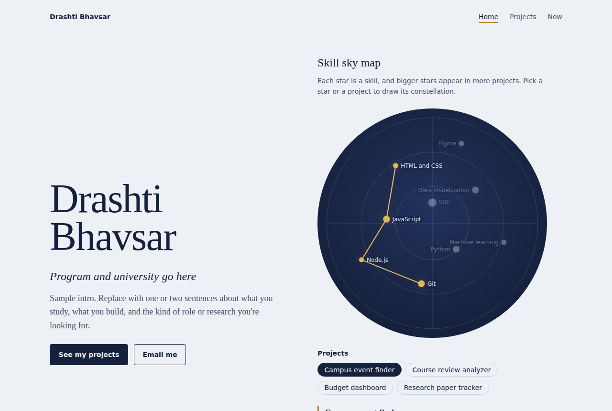

# Drashti Bhavsar: personal homepage

My personal homepage, built with vanilla HTML5, CSS3 and ES6 modules. It has no frameworks, no component libraries and no backend.

- **Author:** Drashti Bhavsar ([GitHub](https://github.com/Drashti0913))
- **Class:** TODO: course name and link to the course page
- **Live site:** [drashti0913.github.io/Portfolio-DrashtiBhavsar](https://drashti0913.github.io/Portfolio-DrashtiBhavsar/)
- **Demo video:** TODO: public video link
- **Design document:** [docs/design-document.md](./docs/design-document.md)



## Project objective

Build a static homepage that helps recruiters, faculty and classmates understand what I work on and how to reach me, while practicing semantic HTML, organized CSS, and JavaScript split into ES6 modules.

## Pages

| Page     | File            | What's on it                                                |
| -------- | --------------- | ----------------------------------------------------------- |
| Home     | `index.html`    | Intro, skill sky map, about, experience, education, contact |
| Projects | `projects.html` | Projects filterable by skill, research, publications        |
| Now      | `now.html`      | AI-generated page about what I'm focused on this season     |

## Original component: skill sky map

The home page shows my skills as stars on a round star chart. A star's size reflects how many of my projects use that skill.

- Pick a **star** to draw lines to the skills it was used with and see the projects that use it. A link opens the projects page already filtered by that skill.
- Pick a **project** to draw its constellation, connecting every skill it used.

Stars are placed with a golden-angle spiral so the chart stays balanced as skills are added. The component uses real buttons, `aria-pressed`, a live region for the readout, and Escape to clear. The code is in [`js/sky.js`](./js/sky.js).

The projects page also has a skill filter ([`js/filter.js`](./js/filter.js)) that keeps the selected skill in the URL, so filtered views can be shared.

## Project structure

```text
.
├── index.html            Home page
├── projects.html         Projects, research and publications
├── now.html              AI-generated "Now" page
├── css/style.css         All styles, organized by tokens, base, layout, components, pages
├── js/
│   ├── main.js           Entry module, runs setup for the current page
│   ├── data.js           All site content (edit this to update the site)
│   ├── render.js         DOM helpers and renderers
│   ├── sky.js            Skill sky map component
│   └── filter.js         Project filter by skill
├── images/               Favicon, photos, screenshot
├── docs/                 Design document and wireframe mockups
├── eslint.config.js      ESLint config
├── .prettierrc           Prettier config
├── package.json
└── LICENSE               MIT
```

## Instructions to build

You need [Node.js](https://nodejs.org/) 18 or newer.

1. Clone the repository and install the dev tools.

```bash
   git clone https://github.com/Drashti0913/Portfolio-DrashtiBhavsar.git
   cd Portfolio-DrashtiBhavsar
   npm install
```

2. Start a local server and open the site. ES modules don't load from `file://`, so use a server.

```bash
   npm start
```

3. Check formatting and linting.

```bash
   npm run format
   npm run lint
```

To update the content, edit `js/data.js`. Each project's `skills` list must use ids from the `skills` list.

## Deployment

The site is deployed with GitHub Pages from the `main` branch (Settings, then Pages, then "Deploy from a branch", then `main` and `/ (root)`).

## Use of generative AI

- **Tool and model:** Claude Opus 5.5 by Anthropic, used through claude.ai, in September 2026.
- **What it was used for:**
  - Converting the content of my earlier Next.js portfolio into a plain HTML, CSS and ES6 module structure that meets the assignment requirements.
  - Drafting the code for the skill sky map and project filter.
  - Generating the `now.html` page, which is the AI-generated page the assignment asks for.
  - Drafting the wireframes, design document and this README.
- **Prompts (summarized):**
  - "Here is the assignment rubric and my current Next.js portfolio. Rebuild it in vanilla HTML, CSS and ES6 modules so it meets every rubric item."
  - "Add an original interactive component that isn't a common portfolio feature."
  - "Write a design document with a project description, user personas, user stories and mockups."
  - "Here are my old Next.js component files. Move my real content from them into data.js."
  - "Show one large photo beside my bio in the About section, and make the Get in touch button scroll to the contact section."
  - "Rewrite any lines Prettier would change so the code passes a Prettier check."
- **What I reviewed and changed by hand:** TODO: list what you edited, for example your real content in `data.js`, wording changes, design tweaks, and anything you fixed or rewrote.

## License

[MIT](./LICENSE)
