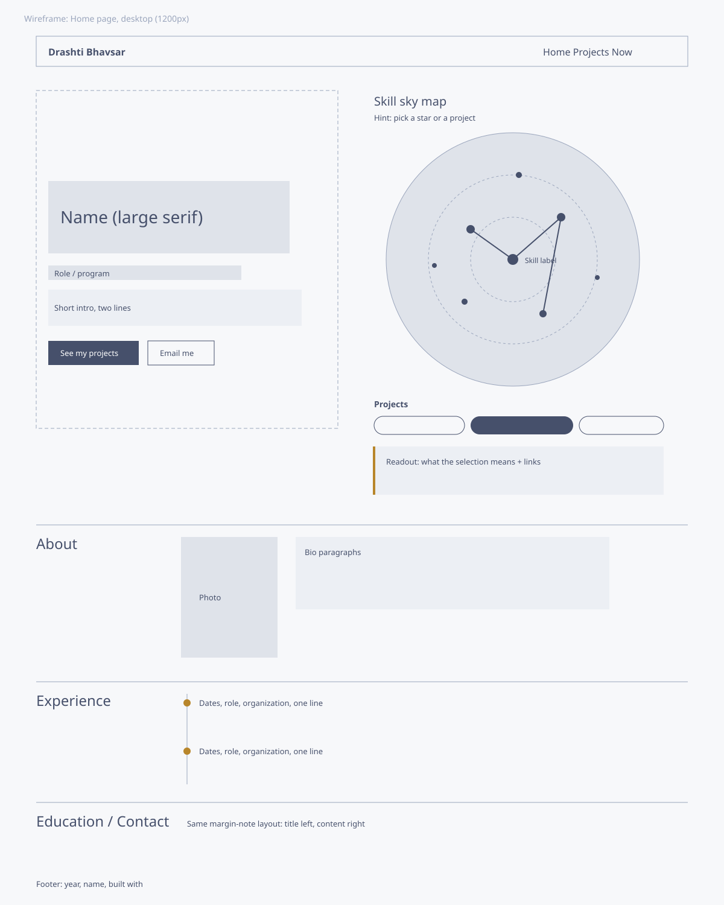
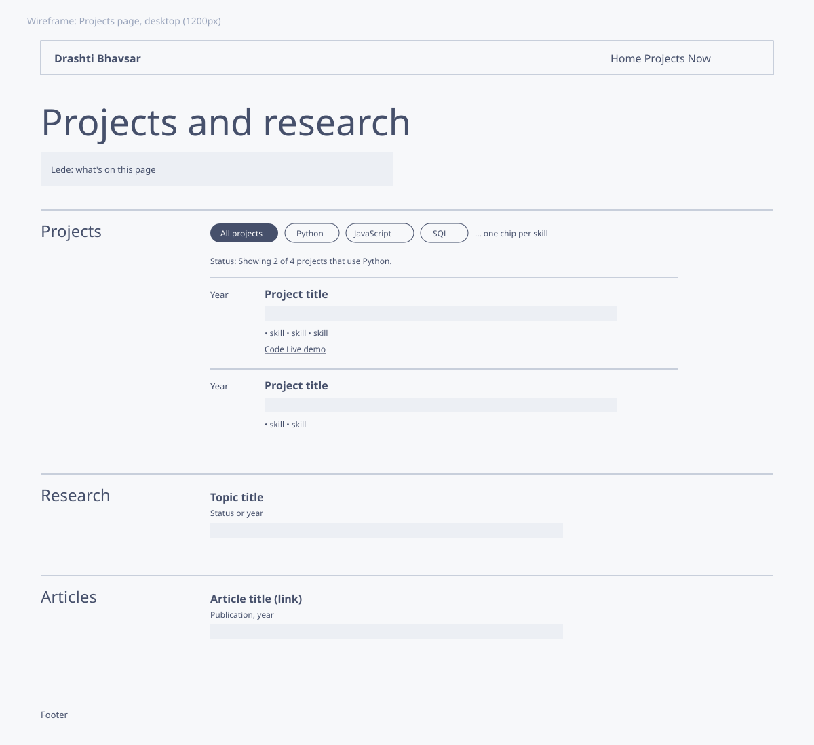
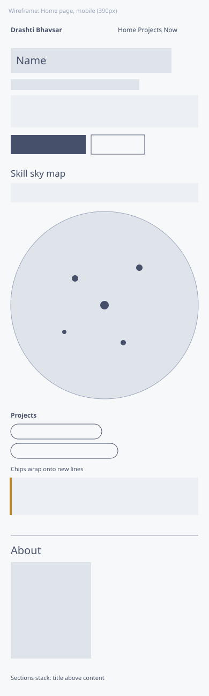

# Design document: Drashti Bhavsar's homepage

## Project description

This is Drashti Bhavsar's personal homepage. It's a static, front-end only site built with vanilla HTML5, CSS3 and ES6 modules, with no frameworks, component libraries or backend.

The site has one job: help someone who has just heard of Drashti understand, in under a minute, what she works on and how to reach her. It has three pages.

- **Home** (`index.html`) introduces her, shows the skill sky map, and covers her background, experience, education and contact details.
- **Projects** (`projects.html`) lists her projects, research and publications. Projects can be filtered by skill.
- **Now** (`now.html`) is an AI-generated page describing what she's focused on this season.

### The original component: skill sky map

Most portfolios list skills as a row of badges, which tells a visitor what someone knows but not how they've used it. The sky map shows skills as stars on a round star chart. A star's size reflects how many projects use that skill, so her strongest skills stand out at a glance.

- Picking a **star** draws lines to every skill it was used with, lists the projects that use it, and links to the projects page pre-filtered by that skill.
- Picking a **project** draws that project's "constellation" by connecting the skills it used.

Stars are placed with a sunflower-spiral layout (golden-angle spacing), so the chart stays balanced however many skills are added. The most-used skills sit near the center. Everything is built from real `<button>` elements, so it works with a keyboard and screen readers, and Escape clears the chart.

### Visual direction

The design borrows from printed star atlases: cool chart-paper gray, navy ink and brass stars. The sky map is the one bold element on the page, and everything around it stays quiet.

| Token    | Value                 | Use                                          |
| -------- | --------------------- | -------------------------------------------- |
| Paper    | `#edf0f4`             | Page background                              |
| Ink      | `#16213d`             | Text, sky background                         |
| Ink soft | `#46506b`             | Secondary text                               |
| Cobalt   | `#2a45b0`             | Links, focus rings                           |
| Brass    | `#b8862b` / `#e2b85c` | Stars, timeline markers, constellation lines |

The typefaces are Newsreader (serif) for headings and body, and Public Sans for navigation, buttons and small labels. Sections use a margin-note layout, with the section title in a narrow left column and content on the right, collapsing to one column on phones.

## User personas

### Priya, technical recruiter

Priya is a university recruiter at a mid-size Boston software company. She reviews dozens of student profiles a day between calls, usually on her laptop and sometimes on her phone. She spends about a minute per candidate.

- **Goals:** confirm the candidate's program and graduation timeline, see real projects, and find contact details fast.
- **Frustrations:** portfolios that hide basic facts behind animations, and skill lists with no evidence behind them.

### Dr. Elena Ruiz, faculty member

Dr. Ruiz runs a research lab and is looking for a graduate research assistant. A student emailed her with a link to this site.

- **Goals:** understand the student's research interests, read one of her published papers, and judge whether the student can work independently.
- **Frustrations:** sites that list "research" with no description of the question or methods.

### Marcus, classmate

Marcus is in the same program and is forming a team for a hackathon. He wants a teammate who complements his back-end skills.

- **Goals:** see which technologies Drashti has actually shipped with and look at her code.
- **Frustrations:** having to open every project just to find out what stack it used.

## User stories

### Priya checks a candidate between calls

Priya has five minutes before her next call and opens Drashti's link from a résumé. The home page loads with Drashti's name, program and a two-line intro right at the top, so within seconds she knows who this is. She glances at the sky map and sees that the biggest stars are the skills her team hires for. She clicks "See my projects," skims the list and its skill tags, then goes back and clicks "Get in touch" to find her email.

_Acceptance:_ name, program and intro are visible without scrolling on desktop and mobile. A **Get in touch** button in the hero leads straight to the contact section. Each project lists the skills it used.

### Dr. Ruiz evaluates a research assistant

Dr. Ruiz opens the site from an email. She goes straight to the Projects page, scrolls to Research, and reads a short description of each research topic and its status. She follows a link to one of Drashti's published papers to see how she writes. Satisfied, she returns to the home page to check her education timeline.

_Acceptance:_ research entries show a title, status and summary. Publications link to the full paper when a URL exists. Education appears in date order on the home page.

### Marcus looks for a teammate who knows data visualization

Marcus opens the home page and clicks the "Data visualization" star on the sky map. Lines light up to the other skills Drashti used alongside it, and a readout lists the projects that used it. He follows "See all Data visualization projects" and lands on the projects page, already filtered. He copies the page link (which keeps the filter) and sends it to his teammate, then follows her GitHub link in the contact section to look at her code.

_Acceptance:_ clicking a star lists matching projects and links to `projects.html?skill=<id>`. The projects page reads the `skill` parameter on load, applies the filter, and updates the URL when the filter changes. All controls work with a keyboard.

### A visitor on a phone

A visitor opens the link on their phone from LinkedIn. The layout stacks into one column, the sky map scales to the screen width, and the project buttons wrap onto new lines. Tapping a project draws its constellation, and the readout below explains what was selected.

_Acceptance:_ no horizontal scrolling at 360px width, and tap targets are at least as large as the label text.

## Design mockups

Low-fidelity wireframes made before building. The final site follows these layouts.

### Home page, desktop

### Projects page, desktop

### Home page, mobile

## Accessibility and quality checklist

- Every interactive element is a native `<button>` or `<a>`, with no clickable `div`s or `span`s.
- Toggle state is exposed with `aria-pressed`, and the sky readout and filter status use `aria-live="polite"`.
- A visible focus ring appears on every control, and a skip link leads to the main content.
- Motion is limited to the constellation line drawing, which is turned off when the visitor prefers reduced motion.
- Every image has `alt` text, and the page passes the W3C validator.
